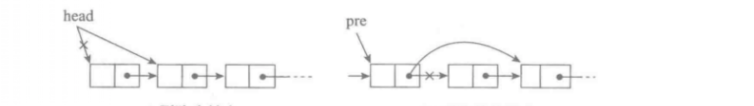
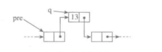

该笔记参考书籍数据结构与算法分析以及浙大数据结构

### 抽象数据类型

抽象数据类型是带有**一组操作**的一些**对象**的集合

- 数据对象集
- 对于对象集的一组操作

### 表

#### 线性表

线性表是由**同类数据元素**构成**有序序列**的线性结构

- 表中元素的个数称为线性表的*长度*
- 线性表没有元素时称为*空表*
- 表起始位置称为*表头*，结束为止称为*表尾*

#### 表的简单数组实现

对表的所有操作都可以通过数组实现

以下程序解释一个数组在必要时如何被扩展

```java
int[] arr = new int[10];
	...
// 扩大arr
int[] newArr = new int[arr.length * 2];
for (int i = 0; i < arr.length; i++) {
     newArr[i] = arr[i];
}
arr = newArr;
```

数组的实现使得 `printList`以线性时间被执行 O(n) ，`findKth`花费常数时间。而插入和删除的花费需要昂贵的开销，这取决于插入和删除的位置。最坏情况下，插入到0的位置需要移动整个数组，删除第一个元素需要移动整个数组，所以这两个的最坏情况为 O(n)，如果所有的操作都发生在表的高端（末尾），则花费常数时间。

如果只发生对数组的访问，数组是表的一种恰当的实现，如果是对表进行插入或删除，尤其是对表的前端进行操作，那么数组就不是一种好的选择。

### 简单链表

**不要求逻辑上相邻的两个元素物理上也相连**，通过链建立起数据元素之间的逻辑关系
https://www.zhihu.com/question/21318658/answer/63652147

为了避免插入和删除的线性开销，我们需要保证表可以**不连续存储**，否则**表的每个部分可能都需要整体移动**

链表由一系列节点组成，这些节点不必在内存中相连。每一个节点表元素以及包含该元素到后继节点的链(link)，称之为next链，最后一个节点的`next`链引用为`null`

为了执行`printList`需要从表的第一个节点开始用后继的`next`链遍历，这种操作是线性的

`remove`需要修改下一个`next`引用来完成



`insert` 需要使用`new`操作符从系统取得一个新节点，此后执行两次引用的调整



插入和删除操作，找到某个元素时间为线性，执行操作时间为常数，对于第一个元素的删除和插入时间为常数

### ArrayList

`ArrayList`的底层是数组，这意味着`get`和`set`将花费常数时间，`add`和`remove`将花费线性时间，如果是最后一个元素则花费常数时间

### LinkedList

`LinkedList`提供了对表头及表尾的操作，这意味着它对于表头表尾的操作只花费常数时间，对于非表头的插入和删除仍花费线性时间，**对于已知位置的插入和删除只花费常数时间**

`LinkedList`的缺点是不容易做索引，对于`get`将花费线性时间，除非调用非常接近表的断点，对于接近表后部的项，搜索可以从表的后部开始